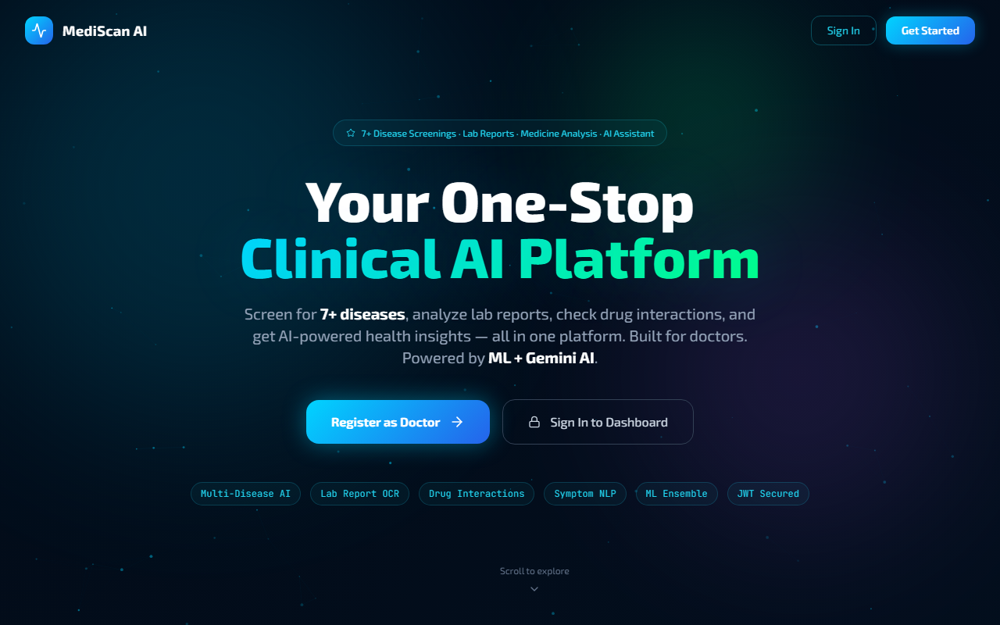
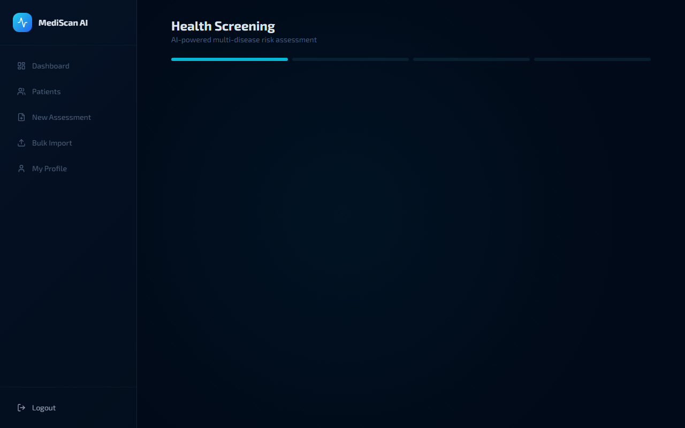
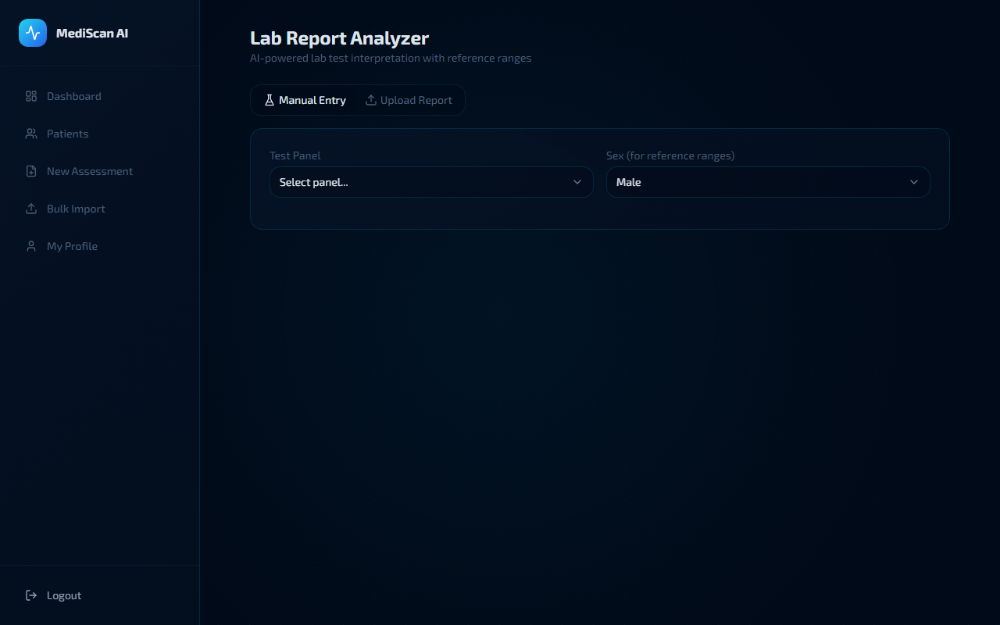
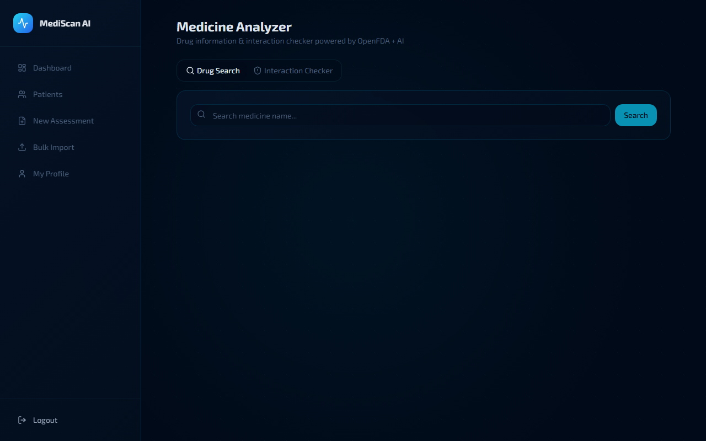
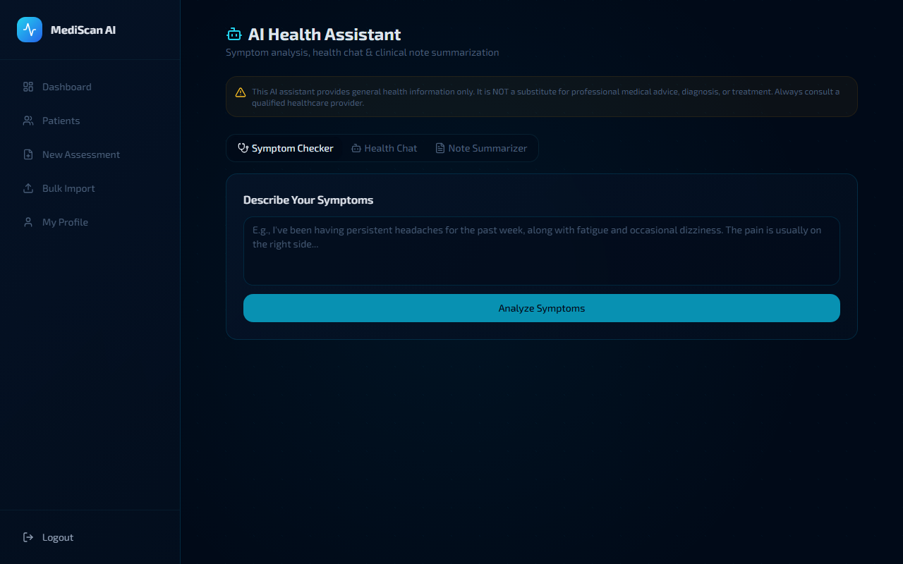
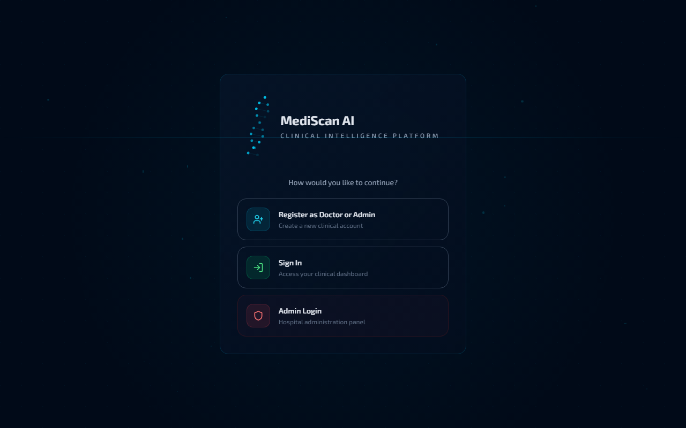

<div align="center">

# MediScan AI
### One-Stop Clinical AI Platform

[](https://python.org)
[](https://djangoproject.com)
[](https://reactjs.org)
[](https://typescriptlang.org)
[](https://ai.google.dev)
[](https://open.fda.gov)

**Live Demo:** [frontend-lake-three-20.vercel.app](https://frontend-lake-three-20.vercel.app)

Screen for 7+ diseases, analyze lab reports, check drug interactions, and chat with an AI health assistant — all in one platform.

</div>

---

## Screenshots

### Landing Page


### Health Screening — Multi-Disease AI


### Lab Report Analyzer


### Medicine Analyzer & Drug Interactions


### AI Health Assistant — Symptom Checker, Chat & Note Summarizer


### Login & Registration


---

## How It Was Built

MediScan AI started as a diabetes risk predictor and evolved into a full clinical intelligence platform. Here's the technical journey:

**Phase 1 — ML Foundation:** Trained a stacking ensemble (Random Forest + XGBoost + LightGBM + Gradient Boosting) on 70,692 CDC Diabetes Health Indicators records. Used SMOTETomek for class imbalance, RobustScaler for preprocessing, and optimized the decision threshold for maximum F1 score. The model achieves 83% ROC-AUC with 88% recall.

**Phase 2 — Full-Stack Platform:** Built the backend with Django REST Framework (JWT auth, role-based access, patient CRUD, assessment workflow) and the frontend with React 18 + TypeScript + Tailwind CSS + Framer Motion for a modern clinical UI with dark mode.

**Phase 3 — Multi-Disease Expansion:** Integrated Google Gemini AI to power risk screening for 6 additional diseases (heart, stroke, kidney, liver, lung, thyroid) with disease-specific health indicator forms. Diabetes still uses the local ML model for zero-latency predictions.

**Phase 4 — Lab Reports & Medicines:** Added a lab report analyzer with medical reference ranges for 6 panels (CBC, lipid, metabolic, liver, kidney, thyroid) plus Gemini Vision for PDF/image OCR extraction. Integrated OpenFDA's free drug API for medicine search and built an AI-powered drug interaction checker.

**Phase 5 — NLP Health Assistant:** Created a symptom checker (describe symptoms in natural language, get urgency assessment and possible conditions), a health chatbot for general questions, and a clinical note summarizer that extracts diagnoses, medications, and follow-up actions.

**Phase 6 — Reliability & Scale:** Implemented multi-key API pools with round-robin load balancing and automatic failover for both Gemini and OpenFDA APIs. Failed keys enter cooldown and are retried automatically.

---

## Features

### Multi-Disease Health Screening
- AI-powered risk screening for 7 diseases: Diabetes, Heart Disease, Stroke, Kidney Disease, Liver Disease, Lung Disease, Thyroid
- Diabetes uses local ML ensemble (no API cost); others powered by Gemini AI
- Risk score, factors, recommendations, and detailed clinical analysis

### Lab Report Analyzer
- Manual entry with 6 lab panels: CBC, Lipid, Metabolic, Liver, Kidney, Thyroid
- Upload PDF/image reports — Gemini Vision extracts values automatically
- Rule-based flagging with medical reference ranges (low/normal/high/critical)
- AI-powered clinical interpretation

### Medicine Analyzer
- Drug search powered by OpenFDA API (free, no key needed)
- Detailed drug info: uses, dosage, side effects, contraindications
- Drug interaction checker for up to 10 medications
- AI-enhanced explanations via Gemini

### AI Health Assistant
- **Symptom Checker**: NLP-powered symptom analysis with condition suggestions and urgency assessment
- **Health Chat**: Conversational AI for general health questions
- **Note Summarizer**: Paste clinical notes, get structured output with diagnoses, medications, and follow-up

### Diabetes ML Assessment
- 3-step wizard with 21 CDC health indicators
- Stacking ensemble: Random Forest + XGBoost + LightGBM + Gradient Boosting
- SHAP-based risk factor explanation and ensemble breakdown
- PDF report download

### Patient Management & Analytics
- Full CRUD with search, filters, and bulk CSV import
- Assessment history with trend charts
- Dashboard with risk distribution, monthly trends, age group analysis
- Real-time activity feed

### Security & Admin
- JWT auth with auto token refresh and rotation
- Role-based access: Admin, Doctor, Nurse, Receptionist
- Admin panel with doctor/patient management and audit logs
- Admin access controlled by `dev22ashish@gmail.com`

---

## ML Architecture

```
CDC Health Survey Data (70,692 records)
            |
    SMOTETomek Resampling
            |
    +---------------------------+
    |      Base Learners        |
    |  Random Forest | XGBoost  |
    |  LightGBM     | Grad.Boost|
    +---------------------------+
            |
    Logistic Regression (Meta)
            |
    Optimal Threshold: 0.3256
            |
      Risk Prediction
```

| Metric | Score |
|--------|-------|
| ROC-AUC | 0.8303 |
| F1-Score | 0.7751 |
| Recall | 0.8765 |
| CV AUC | 0.8711 |

---

## Tech Stack

| Layer | Technology | Purpose |
|-------|-----------|---------|
| **Backend** | Django 4.2 + DRF | REST API |
| **Frontend** | React 18 + TypeScript | UI framework |
| **AI** | Google Gemini 2.0 Flash | Disease screening, lab analysis, NLP |
| **ML** | scikit-learn + XGBoost + LightGBM | Diabetes ensemble model |
| **Drug Data** | OpenFDA API | Medicine search & interaction data |
| **Database** | PostgreSQL (Render) | Data persistence |
| **Auth** | SimpleJWT | Token-based authentication |
| **Styling** | Tailwind CSS + Framer Motion | UI + animations |
| **Charts** | Recharts | Data visualization |
| **Reports** | jsPDF | PDF generation |
| **Hosting** | Vercel + Render | Frontend + Backend |

---

## Quick Start

### Backend
```bash
cd backend
python -m venv venv && source venv/bin/activate
pip install -r requirements.txt
cp .env.example .env  # Fill in credentials
python manage.py migrate
python manage.py runserver
```

### Frontend
```bash
cd frontend
npm install --legacy-peer-deps
echo "VITE_API_URL=http://localhost:8000" > .env.local
npm run dev
```

---

## Environment Variables

### Backend (.env)
```env
DEBUG=True
SECRET_KEY=your-secret-key-min-50-chars
DB_NAME=mediscan_db
DB_USER=postgres
DB_PASSWORD=your-db-password
DB_HOST=localhost
DB_PORT=5432
ALLOWED_HOSTS=localhost,127.0.0.1
CORS_ALLOWED_ORIGINS=http://localhost:3000,http://localhost:5173
ADMIN_SECRET_CODE=your-admin-secret-code
FRONTEND_URL=http://localhost:5173
GEMINI_API_KEY=your-gemini-api-key
# Multiple Gemini keys for load balancing:
# GEMINI_API_KEYS=key1,key2,key3
```

### Frontend (.env.local)
```env
VITE_API_URL=http://localhost:8000
```

---

## API Endpoints

```
Authentication:
  POST /api/auth/login/                    JWT login
  POST /api/auth/register/                 Register user
  POST /api/auth/refresh/                  Refresh token

Patients:
  GET  /api/patients/                      List patients
  POST /api/patients/                      Create patient
  POST /api/patients/assessments/create/   Diabetes ML assessment

Screening:
  GET  /api/screening/diseases/            List available diseases
  POST /api/screening/create/              Run AI disease screening

Lab Reports:
  GET  /api/reports/panels/                List lab test panels
  POST /api/reports/analyze/               Analyze manual values
  POST /api/reports/upload/                Upload + AI extraction

Medicines:
  GET  /api/medicines/search/?q=name       Search drugs (OpenFDA)
  GET  /api/medicines/{drug_name}/         Drug details + AI
  POST /api/medicines/interactions/        Check interactions

AI Assistant:
  POST /api/ai/symptoms/                   Symptom analysis
  POST /api/ai/chat/                       Health chatbot
  POST /api/ai/summarize-notes/            Clinical note summary

Analytics:
  GET  /api/analytics/summary/             Dashboard stats
  GET  /api/analytics/risk-distribution/   Risk distribution
  GET  /api/analytics/trends/              Monthly trends

Admin:
  GET  /api/admin-panel/dashboard/         Admin stats
  GET  /api/admin-panel/doctors/           Doctor management
  GET  /api/docs/                          Swagger UI
```

---

## Project Structure

```
mediscan-ai/
├── backend/
│   ├── config/          # Django settings, URLs
│   ├── users/           # Auth, profiles, password reset
│   ├── patients/        # Patient & assessment models
│   ├── screening/       # Multi-disease AI screening
│   ├── reports/         # Lab report analysis + reference ranges
│   ├── medicines/       # Drug search, interactions (OpenFDA)
│   ├── ai_engine/       # Gemini AI client, NLP views
│   ├── ml_engine/       # ML training, prediction, SHAP
│   ├── analytics/       # Dashboard data aggregation
│   └── admin_panel/     # Hospital admin management
│
└── frontend/
    └── src/
        ├── pages/       # All route pages (13 pages)
        ├── components/  # Reusable UI + shadcn/ui
        └── lib/         # API client, PDF generation
```

---

## Author

**Devashish**

[](https://github.com/DMZ22)
[](mailto:dev22ashish@gmail.com)

---

<div align="center">
<sub>Built with Django, React, Gemini AI, scikit-learn, and OpenFDA</sub>
</div>
